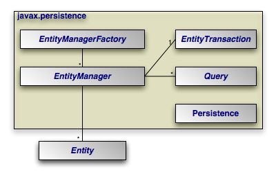

# GraphQL + SpringBoot + Java + Oracle Database

<div style="display: flex;">
    
    
    
    
</div>

## Aplicativo solicitado: **Aparatos electrónicos**

Una empresa de aparatos electrónicos desea informatizar los datos de su catálogo de aparatos electrónicos dando la siguiente definición:

Cada aparato electrónico viene determinado por un código único y una descripción. Además, cada aparato corresponde a un tipo de electrodomésticos. Cada tipo de electrodoméstico (televisor, mp3, lavadora, etc) tiene un nombre y unas características. Se supone que no hay dos tipos con el mismo nombre y características. Algunos tipos pueden formar parte de otro tipo más general (mp3 de aparato de música), pero los aparatos electrónicos solo forman parte de un único tipo.

Los componentes son las piezas que forman el aparato. Vienen dados por un nombre (por ejemplo transformador) y unas especificaciones. También nos interesa conocer datos de los fabricantes de componentes: su RIF y su Domicilio Fiscal.

Cada aparato puede llevar cualquier cantidad de componentes. Interesa saber para cada aparato que componentes lleva y que fabricante suministra cada componente. Un aparato puede llevar muchas unidades de un mismo componente (interesa saber cuántas), pero en este caso todas estarán suministradas por el mismo fabricante y con un mismo precio.

La empresa además realiza la reparación de los aparatos electrónicos que existen en el catálogo. De estas reparaciones interesa saber la información del cliente que manda a reparar su aparato electrónico tal como número de documento, dirección, teléfono y correo electrónico. De estas reparaciones interesa saber la referencia del aparato que se reparó (la cual sale del catálogo), una descripción y la fecha de reparación. La reparación puede o no implicar cambios en los componentes del aparato electrónico por lo que también se desea saber cuales componentes fueron cambiados en una reparación.

> CREAR UN APLICATIVO JAVA QUE PERMITA LAS ACCIONES DE CRUD PARA CADA UNA DE LAS ENTIDADES DESCRITAS EN EL PROBLEMA.
RETO CONCEPTUAL

El reto de este caso consiste en integrar GrapQL al proyecto desarrollado. 

## Integrantes del Equipo

| Nombre       | LinkedIn                                       |
|--------------|------------------------------------------------|
| Jeffersson David Bastidas Gaona    | [Perfil de Jeffersson Bastidas en LinkedIn](https://www.linkedin.com/in/jeffersson-david-bastidas-077251104/) |
| Juan Sebastian Mora Tibamoso   | [Perfil de Sebastian Mora en LinkedIn](https://www.linkedin.com/in/jsebastianm/) |
| Milton Alejandro Pacheco Rincon | [Perfil de Milton Pacheco en LinkedIn](https://www.linkedin.com/in/miltonpacheco01/)

## ¿Qué es GraphQL?

[GraphQL](https://graphql.org/) es un lenguaje de consulta para API *Application Programming Interface* y un tiempo de ejecución para completar esas consultas con sus datos existentes. GraphQL proporciona una descripción completa y comprensible de los datos de su API, brinda a los clientes el poder de solicitar exactamente lo que necesitan y nada más, facilita la evolución de las API con el tiempo y habilita potentes herramientas para desarrolladores. 

<div class="nextra-codeblocks flex *:w-1/2 [&amp;_pre]:!h-48" aria-hidden="true"><div class="nextra-code _relative _mt-6 first:_mt-0"><div class="_px-4 _text-xs _text-gray-700 dark:_text-gray-200 _bg-gray-100 dark:_bg-neutral-900 _flex _items-center _h-12 _gap-2 _rounded-t-md _border _border-gray-300 dark:_border-neutral-700 contrast-more:_border-gray-900 contrast-more:dark:_border-gray-50 _border-b-0"><span class="_truncate"><font style="vertical-align: inherit;"><font style="vertical-align: inherit;">Consulta</font></font></span></div><pre class="_overflow-x-auto _subpixel-antialiased _text-[.9em] _bg-white dark:_bg-black _py-4 _ring-1 _ring-inset _ring-gray-300 dark:_ring-neutral-700 contrast-more:_ring-gray-900 contrast-more:dark:_ring-gray-50 contrast-more:_contrast-150 _rounded-b-md p-4"><font style="vertical-align: inherit;"><font style="vertical-align: inherit;">{ </font></font><!-- --><font style="vertical-align: inherit;"><font style="vertical-align: inherit;">
  héroe </font><span id="ch10" class="hidden" style="display: none;"><font style="vertical-align: inherit;">{</font></span></font><!-- --><font style="vertical-align: inherit;"><font style="vertical-align: inherit;"> 
    nombre </font><span id="ch5" class="hidden" style="display: none;"><font style="vertical-align: inherit;">altura</font></span><span id="ch6" class="hidden" style="display: none;"><font style="vertical-align: inherit;">​</font></span><span id="ch7" class="hidden" style="display: none;"><font style="vertical-align: inherit;">​</font></span><span id="ch8" class="hidden" style="display: none;"><font style="vertical-align: inherit;">​</font></span><span id="ch9" class="hidden" style="display: none;"><font style="vertical-align: inherit;">​</font></span></font><span id="ch0" class="hidden" style="display: inline;"><br></span><span id="ch1" class="hidden" style="display: none;"> </span><span id="ch2" class="hidden" style="display: none;"> </span><span id="ch3" class="hidden" style="display: none;"> </span><span id="ch4" class="hidden" style="display: none;"> </span><span id="ch5" class="hidden" style="display: inline;"><font style="vertical-align: inherit;"></font></span><span id="ch6" class="hidden" style="display: none;"><font style="vertical-align: inherit;"></font></span><span id="ch7" class="hidden" style="display: none;"><font style="vertical-align: inherit;"></font></span><span id="ch8" class="hidden" style="display: none;"><font style="vertical-align: inherit;"></font></span><span id="ch9" class="hidden" style="display: none;"><font style="vertical-align: inherit;"></font></span><span id="ch10" class="hidden" style="display: none;"><font style="vertical-align: inherit;"></font></span><span id="ch11" class="hidden" style="display: none;"><br></span><span id="ch12" class="hidden" style="display: none;"> </span><span id="ch13" class="hidden" style="display: none;"> </span><span id="ch14" class="hidden" style="display: none;"> </span><span id="ch15" class="hidden" style="display: none;"> </span><span id="ch16" class="hidden" style="display: none;"><font style="vertical-align: inherit;"><font style="vertical-align: inherit;">metro</font></font></span><span id="ch17" class="hidden" style="display: none;"><font style="vertical-align: inherit;"><font style="vertical-align: inherit;">a</font></font></span><span id="ch18" class="hidden" style="display: none;"><font style="vertical-align: inherit;"><font style="vertical-align: inherit;">s</font></font></span><span id="ch19" class="hidden" style="display: none;"><font style="vertical-align: inherit;"><font style="vertical-align: inherit;">s</font></font></span><span class="inline-block !bg-primary/50 h-4 w-2 ml-px -mb-0.5 predictable-results_cursor__iK5iH"></span><font style="vertical-align: inherit;"><font style="vertical-align: inherit;">
  } </font></font><!-- --><font style="vertical-align: inherit;"><font style="vertical-align: inherit;">
}</font></font></pre><div class="_opacity-0 _transition [div:hover>&amp;]:_opacity-100 focus-within:_opacity-100 _flex _gap-1 _absolute _right-4 _top-14"></div></div><div class="nextra-code _relative _mt-6 first:_mt-0"><div class="_px-4 _text-xs _text-gray-700 dark:_text-gray-200 _bg-gray-100 dark:_bg-neutral-900 _flex _items-center _h-12 _gap-2 _rounded-t-md _border _border-gray-300 dark:_border-neutral-700 contrast-more:_border-gray-900 contrast-more:dark:_border-gray-50 _border-b-0"><span class="_truncate"><font style="vertical-align: inherit;"><font style="vertical-align: inherit;">Respuesta</font></font></span></div><pre class="_overflow-x-auto _subpixel-antialiased _text-[.9em] _bg-white dark:_bg-black _py-4 _ring-1 _ring-inset _ring-gray-300 dark:_ring-neutral-700 contrast-more:_ring-gray-900 contrast-more:dark:_ring-gray-50 contrast-more:_contrast-150 _rounded-b-md" tabindex="0"><code class="nextra-code" dir="ltr"><span><span style="--shiki-light:#24292E;--shiki-dark:#E1E4E8">{</span></span>
<span><span style="--shiki-light:#005CC5;--shiki-dark:#79B8FF">  "hero"</span><span style="--shiki-light:#24292E;--shiki-dark:#E1E4E8">: {</span></span>
<span><span style="--shiki-light:#005CC5;--shiki-dark:#79B8FF">    "name"</span><span style="--shiki-light:#24292E;--shiki-dark:#E1E4E8">: </span><span style="--shiki-light:#032F62;--shiki-dark:#9ECBFF">"Luke Skywalker"</span><span style="--shiki-light: #24292E; --shiki-dark: #E1E4E8; display: none;">,</span></span>
<span style="display: none;"><span style="--shiki-light:#005CC5;--shiki-dark:#79B8FF">    "height"</span><span style="--shiki-light:#24292E;--shiki-dark:#E1E4E8">: </span><span style="--shiki-light:#005CC5;--shiki-dark:#79B8FF">1.72</span><span style="--shiki-light: #24292E; --shiki-dark: #E1E4E8; display: inline;">,</span></span>
<span style="display: none;"><span style="--shiki-light:#005CC5;--shiki-dark:#79B8FF">    "mass"</span><span style="--shiki-light:#24292E;--shiki-dark:#E1E4E8">: </span><span style="--shiki-light:#005CC5;--shiki-dark:#79B8FF">77</span></span>
<span><span style="--shiki-light:#24292E;--shiki-dark:#E1E4E8">  }</span></span>
<span><span style="--shiki-light:#24292E;--shiki-dark:#E1E4E8">}</span></span></code></pre><div class="_opacity-0 _transition [div:hover>&amp;]:_opacity-100 focus-within:_opacity-100 _flex _gap-1 _absolute _right-4 _top-14"></div></div></div>


## ¿Para que sirve?

- Las consultas GraphQL acceden no solo a las propiedades de un recurso, sino que también siguen sin problemas las referencias entre ellos. Si bien las API REST típicas requieren carga desde múltiples URL, las API GraphQL obtienen todos los datos que su aplicación necesita en una sola solicitud. Las aplicaciones que utilizan GraphQL pueden ser rápidas incluso en conexiones de red móviles lentas.
- Las API de GraphQL están organizadas en términos de tipos y campos, no de puntos finales. Acceda a todas las capacidades de sus datos desde un único punto final. GraphQL utiliza tipos para garantizar que las aplicaciones solo soliciten lo que es posible y proporcionen errores claros y útiles. Las aplicaciones pueden usar tipos para evitar escribir código de análisis manual.
- Agregue nuevos campos y tipos a su API GraphQL sin afectar las consultas existentes. Los campos antiguos pueden quedar obsoletos y ocultarse de las herramientas. Al utilizar una única versión en evolución, las API GraphQL brindan a las aplicaciones acceso continuo a nuevas funciones y fomentan un código de servidor más limpio y fácil de mantener.
- GraphQL crea una API uniforme en toda su aplicación sin estar limitado por un motor de almacenamiento específico. Escriba API GraphQL que aprovechen sus datos y código existentes con motores GraphQL disponibles en muchos idiomas. Usted proporciona funciones para cada campo en el sistema de tipos y GraphQL las llama con una concurrencia óptima.

## ¿Quién usa GraphQL?

<div class="flex flex-wrap gap-10 lg:gap-16 justify-center mt-10 mb-20">
    <a href="https://facebook.com" target="_blank" rel="noreferrer" class="shrink-0">
        
    </a>
    <a href="https://docs.github.com/en/graphql" target="_blank" rel="noreferrer" class="shrink-0">
        
    </a>
    <a href="https://pinterest.com" target="_blank" rel="noreferrer" class="shrink-0">
        
    </a>
    <a href="https://intuit.com" target="_blank" rel="noreferrer" class="shrink-0">
        
    </a>
    <a href="https://coursera.org" target="_blank" rel="noreferrer" class="shrink-0">
        
    </a>
    <a href="https://shopify.com" target="_blank" rel="noreferrer" class="shrink-0">
        
    </a>
</div>

## [Repositorio](https://github.com/graphql)

## Principales Conceptos

1. **Schema (Esquema):** Define la estructura de los datos disponibles y las operaciones que se pueden realizar en ellos. El esquema describe los tipos de datos disponibles y las relaciones entre ellos.
2. **Type (Tipo):** Representa un conjunto de campos que tienen un propósito común, como un objeto, una interfaz o un escalar (por ejemplo, String, Int, Boolean, etc.).
3. **Query (Consulta):** Es una operación para recuperar datos del servidor. Las consultas GraphQL permiten al cliente especificar exactamente qué datos necesita y cómo desea que se devuelvan.
4. **Mutation (Mutación):** Es una operación para modificar datos en el servidor. Las mutaciones GraphQL permiten al cliente agregar, actualizar o eliminar datos.
5. **Subscription (Suscripción):** Permite al cliente recibir notificaciones en tiempo real cuando ocurren cambios en los datos del servidor. Las suscripciones GraphQL son útiles para casos de uso en tiempo real, como chat en línea o actualizaciones en vivo.
6. **Resolver:** Es una función que se encarga de devolver los datos solicitados por una consulta GraphQL. Cada campo en el esquema de GraphQL tiene un resolver asociado que determina cómo se obtiene el valor para ese campo.
7. **Fragmento (Fragment):** Es una forma de reutilizar y organizar consultas GraphQL. Los fragmentos permiten definir un conjunto de campos que se pueden incluir en múltiples consultas.
8. **Directiva:** Permite modificar el comportamiento de las consultas o mutaciones GraphQL. Las directivas pueden usarse para incluir o excluir campos condicionalmente, paginar resultados, etc.


## Demostración del caso de Estudio

Se siguen las siguientes etapas:


### Modelado de esquema de base de datos

1. Se efectua el siguiente modelado


2. Se crea el siguiente script según motor [Oracle](https://www.oracle.com/co/)

```SQL
DROP USER PROYECTO CASCADE;
CREATE USER PROYECTO IDENTIFIED BY A;
GRANT CONNECT, RESOURCE TO PROYECTO;
ALTER USER PROYECTO QUOTA UNLIMITED ON USERS;
ALTER SESSION SET "_ORACLE_SCRIPT"=TRUE;
CONN PROYECTO/A

/==============================================================/
/* CREACION DE SECUENCIAS                                       */
/==============================================================/
CREATE SEQUENCE SUBTIPO_SEQ START WITH 1 INCREMENT BY 1 MAXVALUE 1000000 MINVALUE 1 NOCYCLE;
CREATE SEQUENCE TIPO_SEQ START WITH 1 INCREMENT BY 1 MAXVALUE 1000000 MINVALUE 1 NOCYCLE;
CREATE SEQUENCE APARATO_SEQ START WITH 1 INCREMENT BY 1 MAXVALUE 1000000 MINVALUE 1 NOCYCLE;
CREATE SEQUENCE COMPONENTE_SEQ START WITH 1 INCREMENT BY 1 MAXVALUE 1000000 MINVALUE 1 NOCYCLE;
CREATE SEQUENCE COMPONENTE_APARATO_SEQ START WITH 1 INCREMENT BY 1 MAXVALUE 1000000 MINVALUE 1 NOCYCLE;
CREATE SEQUENCE FABRICANTE_SEQ START WITH 1 INCREMENT BY 1 MAXVALUE 1000000 MINVALUE 1 NOCYCLE;
CREATE SEQUENCE CLIENTE_SEQ START WITH 1 INCREMENT BY 1 MAXVALUE 1000000 MINVALUE 1 NOCYCLE;
CREATE SEQUENCE REPARACION_SEQ START WITH 1 INCREMENT BY 1 MAXVALUE 1000000 MINVALUE 1 NOCYCLE;
CREATE SEQUENCE MODIFICACION_SEQ START WITH 1 INCREMENT BY 1 MAXVALUE 1000000 MINVALUE 1 NOCYCLE;

/==============================================================/
/* CREACION DE TABLAS                                           */
/==============================================================/
CREATE TABLE SUBTIPOS(
SUBTIPO_ID NUMBER DEFAULT SUBTIPO_SEQ.NEXTVAL,
DESCRIPCION VARCHAR(250),
TIPO_ID NUMBER,
CONSTRAINT PK_SUBTIPO PRIMARY KEY (SUBTIPO_ID)
);

CREATE TABLE TIPOS(
TIPO_ID NUMBER DEFAULT TIPO_SEQ.NEXTVAL,
DESCRIPCION VARCHAR(250),
CARACTERISTICAS VARCHAR(250),
CONSTRAINT PK_TIPO PRIMARY KEY (TIPO_ID)
);

CREATE TABLE APARATOS_ELECTRONICOS(
APARATO_ID NUMBER DEFAULT APARATO_SEQ.NEXTVAL,
DESCRIPCION VARCHAR(250),
TIPO_ID NUMBER,
CONSTRAINT PK_APARATO PRIMARY KEY (APARATO_ID)
);

CREATE TABLE COMPONENTES(
COMPONENTE_ID NUMBER DEFAULT COMPONENTE_SEQ.NEXTVAL,
ESPECIFICACIONES VARCHAR(250),
FABRICANTE_ID NUMBER,
CONSTRAINT PK_COMPONENTE PRIMARY KEY (COMPONENTE_ID)
);

CREATE TABLE FABRICANTES(
FABRICANTE_ID NUMBER DEFAULT FABRICANTE_SEQ.NEXTVAL, 
RIF VARCHAR(50),
DOMINIO_FISCAL VARCHAR(50),
CONSTRAINT PK_FABRICANTE PRIMARY KEY (FABRICANTE_ID)
);

CREATE TABLE CLIENTES(
CLIENTE_ID NUMBER DEFAULT CLIENTE_SEQ.NEXTVAL,
NOMBRE VARCHAR(50),
APELLIDO VARCHAR(50),
DOCUMENTO NUMBER(20),
DIRECCION VARCHAR(250),
TELEFONO NUMBER(10),
CORREO VARCHAR(100),
CONSTRAINT PK_CLIENTE PRIMARY KEY (CLIENTE_ID)
);

CREATE TABLE REPARACIONES(
REPARACION_ID NUMBER DEFAULT REPARACION_SEQ.NEXTVAL,
DESCRIPCION VARCHAR(250),
CLIENTE_ID NUMBER,
APARATO_ID NUMBER,
FECHA DATE,
CONSTRAINT PK_REPARACION PRIMARY KEY (REPARACION_ID)
);

CREATE TABLE MODIFICACIONES(
MODIFICACION_ID NUMBER DEFAULT MODIFICACION_SEQ.NEXTVAL,
DESCRIPCION VARCHAR(250),
COMPONENTE_ID NUMBER,
REPARACION_ID NUMBER,
CONSTRAINT PK_MODIFICACION PRIMARY KEY (MODIFICACION_ID)
);

CREATE TABLE COMPONENTES_APARATOS(
COMPONENTE_APARATO_ID NUMBER DEFAULT COMPONENTE_APARATO_SEQ.NEXTVAL,
COMPONENTE_ID NUMBER,
APARATO_ID NUMBER,
CANTIDAD NUMBER,
CONSTRAINT PK_COMPONENTE_APARATO PRIMARY KEY (COMPONENTE_APARATO_ID)
);

/==============================================================/
/* CREACION DE FOREIGN KEYS                                     */
/==============================================================/
ALTER TABLE SUBTIPOS
   ADD CONSTRAINT FK_TIPO1 FOREIGN KEY (TIPO_ID)
      REFERENCES TIPOS (TIPO_ID);

ALTER TABLE APARATOS_ELECTRONICOS
   ADD CONSTRAINT FK_TIPO2 FOREIGN KEY (TIPO_ID)
      REFERENCES TIPOS (TIPO_ID);

ALTER TABLE COMPONENTES
   ADD CONSTRAINT FK_FABRICANTE FOREIGN KEY (FABRICANTE_ID)
      REFERENCES FABRICANTES (FABRICANTE_ID);

ALTER TABLE REPARACIONES
   ADD CONSTRAINT FK_CLIENTE FOREIGN KEY (CLIENTE_ID)
      REFERENCES CLIENTES (CLIENTE_ID);

ALTER TABLE REPARACIONES
   ADD CONSTRAINT FK_APARATO FOREIGN KEY (APARATO_ID)
      REFERENCES APARATOS_ELECTRONICOS (APARATO_ID);

ALTER TABLE MODIFICACIONES
   ADD CONSTRAINT FK_REPARACION FOREIGN KEY (REPARACION_ID)
      REFERENCES REPARACIONES (REPARACION_ID);

ALTER TABLE MODIFICACIONES
   ADD CONSTRAINT FK_COMPONENTE FOREIGN KEY (COMPONENTE_ID)
      REFERENCES COMPONENTES (COMPONENTE_ID);

ALTER TABLE COMPONENTES_APARATOS
   ADD CONSTRAINT FK_APARATO2 FOREIGN KEY (APARATO_ID)
      REFERENCES APARATOS_ELECTRONICOS (APARATO_ID);

ALTER TABLE COMPONENTES_APARATOS
   ADD CONSTRAINT FK_COMPONENTE2 FOREIGN KEY (COMPONENTE_ID)
      REFERENCES COMPONENTES (COMPONENTE_ID);

```

### Implementación con JPA usando Java

Se procede a crear un proyecto con persistencia usando JPA. Para esto nos apoyaremos en el IDE de *Intellij IDEA Ultimate Edition*. Se realiza un mapeo sobre cada tabla en la base de datos representada por una clase en Java.



### Implementación con SpringBoot y GraphQL

Se crea un proyecto en SpringBoot usando Intellij, en esta ocasión se selecciona lo siguiente al momento de crear el proyecto
- Gradle
- Versión 17 de Java
- SpringBoot DevTools
- Spring Web
- Spring Data JPA
- Spring for GraphQL
- OracleDriver

Se termina mapeando el sigueine modelo UML con los metodos utilizados por GraphQL

## [UML Model](./Assets/UML_Doc.pdf)

### Conclusiones

- Flexibilidad en la recuperación de datos: GraphQL permite a los clientes solicitar solo los datos que necesitan, lo que evita el problema de sobre o infra-solicitar datos, común en las API REST. Esto puede mejorar significativamente el rendimiento de la aplicación al reducir la cantidad de datos transferidos.

- Reducción de la sobrecarga de red: Al permitir que los clientes especifiquen exactamente los campos que necesitan en una sola solicitud, GraphQL puede reducir el número de solicitudes a la API y, por lo tanto, la sobrecarga de red.

- Desarrollo frontend más eficiente: Con GraphQL, los desarrolladores frontend pueden trabajar de manera más independiente del backend, ya que pueden diseñar y ejecutar consultas personalizadas sin necesidad de cambios en el backend.

- Mayor evolución de la API sin romper la compatibilidad: GraphQL permite agregar nuevos campos o tipos a la API sin afectar a las versiones existentes. Esto facilita la evolución de la API con el tiempo sin romper la compatibilidad con los clientes existentes.

- Documentación integrada y autoexplorable: Con GraphQL, el esquema de la API actúa como una forma de documentación autoexplorable. Los clientes pueden explorar y descubrir fácilmente la estructura y los tipos de datos disponibles utilizando herramientas como GraphiQL.


