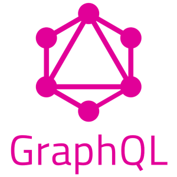

# GraphQL + SpringBoot + Java + Oracle Database (🇺🇸)

<div style="display: flex;">
    
    
    
    
</div>


## Requested Application: **Electronic Devices**

A company dealing with electronic devices wants to digitize the data from its catalog of electronic devices with the following definition:

Each electronic device is identified by a unique code and a description. Additionally, each device corresponds to a type of appliance. Each type of appliance (such as TV, MP3 player, washing machine, etc.) has a name and some characteristics. It is assumed that there are no two types with the same name and characteristics. Some types may be part of a more general type (e.g., MP3 player as part of a music device), but electronic devices belong to only one type.

Components are the parts that make up the device. They are defined by a name (e.g., transformer) and specifications. We are also interested in knowing information about component manufacturers: their RIF (Taxpayer's Registry Identification) and their Fiscal Address.

Each device can have any number of components. It's important to know, for each device, which components it contains and which manufacturer supplies each component. A device can have many units of the same component (we need to know how many), but in this case, they will all be supplied by the same manufacturer and at the same price.

The company also performs repairs on electronic devices in its catalog. For these repairs, we are interested in the information of the customer who sends their electronic device for repair, such as document number, address, phone, and email. For these repairs, we want to know the reference of the device that was repaired (which comes from the catalog), a description, and the repair date. The repair may or may not involve changes to the components of the electronic device, so we also want to know which components were changed in a repair.

> CREATE A JAVA APPLICATION THAT ALLOWS CRUD ACTIONS FOR EACH OF THE ENTITIES DESCRIBED IN THE PROBLEM.
CONCEPTUAL CHALLENGE

The challenge in this case is to integrate GraphQL into the developed project.

## Team Members

| Name          | LinkedIn                                       |
|--------------|------------------------------------------------|
| Jeffersson David Bastidas Gaona    | [Jeffersson Bastidas's LinkedIn Profile](https://www.linkedin.com/in/jeffersson-david-bastidas-077251104/) |
| Juan Sebastian Mora Tibamoso   | [Sebastian Mora's LinkedIn Profile](https://www.linkedin.com/in/jsebastianm/) |
| Milton Alejandro Pacheco Rincon | [Milton Pacheco's LinkedIn Profile](https://www.linkedin.com/in/miltonpacheco01/)

## What is GraphQL?

[GraphQL](https://graphql.org/) is a query language for Application Programming Interfaces (APIs) and a runtime for executing those queries with your existing data. GraphQL provides a complete and understandable description of the data in your API, gives clients the power to ask for exactly what they need and nothing more, facilitates the evolution of APIs over time, and enables powerful developer tools.

## What is it used for?

- GraphQL queries access not just the properties of one resource but also smoothly follow references between them. While typical REST APIs require loading from multiple URLs, GraphQL APIs get all the data your app needs in a single request. Apps using GraphQL can be quick even on slow mobile network connections.
- GraphQL APIs are organized in terms of types and fields, not endpoints. Access the full capabilities of your data from a single endpoint. GraphQL uses types to ensure apps only ask for what’s possible and provide clear and helpful errors. Apps can use types to avoid writing manual parsing code.
- Add new fields and types to your GraphQL API without impacting existing queries. Old fields can be deprecated and hidden from tools. By using a single evolving version, GraphQL APIs give apps continuous access to new features and encourage cleaner server-side code that’s easy to maintain.
- GraphQL creates a uniform API across your entire application without being limited by a specific storage engine. Write GraphQL APIs that leverage your existing data and code with GraphQL engines available in many languages. You provide functions for each field in the type system and GraphQL calls them with optimal concurrency.

## Who uses GraphQL?

<div style="display: flex; justify-content: space-between;">
    
    
    
    
    
    
</div>


## [Repository](https://github.com/graphql)

## Main Concepts

1. **Schema:** Defines the structure of the available data and the operations that can be performed on them. The schema describes the types of available data and the relationships between them.
2. **Type:** Represents a set of fields that have a common purpose, such as an object, an interface, or a scalar (e.g., String, Int, Boolean, etc.).
3. **Query:** An operation to retrieve data from the server. GraphQL queries allow the client to specify exactly what data they need and how they want it returned.
4. **Mutation:** An operation to modify data on the server. GraphQL mutations allow the client to add, update, or delete data.
5. **Subscription:** Allows the client to receive real-time notifications when changes occur in the server's data. GraphQL subscriptions are useful for real-time use cases like online chat or live updates.
6. **Resolver:** A function responsible for returning the data requested by a GraphQL query. Each field in the GraphQL schema has an associated resolver that determines how the value for that field is obtained.
7. **Fragment:** A way to reuse and organize GraphQL queries. Fragments allow you to define a set of fields that can be included in multiple queries.
8. **Directive:** Allows modifying the behavior of GraphQL queries or mutations. Directives can be used to conditionally include or exclude fields, paginate results, etc.

## Case Study Demo

The following stages are followed:


### Database Schema Modeling

1. The following modeling is carried out:


2. The following script is created according to the [Oracle](https://www.oracle.com/) engine

```SQL
DROP USER PROYECTO CASCADE;
CREATE USER PROYECTO IDENTIFIED BY A;
GRANT CONNECT, RESOURCE TO PROYECTO;
ALTER USER PROYECTO QUOTA UNLIMITED ON USERS;
ALTER SESSION SET "_ORACLE_SCRIPT"=TRUE;
CONN PROYECTO/A

/==============================================================/
/* CREACION DE SECUENCIAS                                       */
/==============================================================/
CREATE SEQUENCE SUBTIPO_SEQ START WITH 1 INCREMENT BY 1 MAXVALUE 1000000 MINVALUE 1 NOCYCLE;
CREATE SEQUENCE TIPO_SEQ START WITH 1 INCREMENT BY 1 MAXVALUE 1000000 MINVALUE 1 NOCYCLE;
CREATE SEQUENCE APARATO_SEQ START WITH 1 INCREMENT BY 1 MAXVALUE 1000000 MINVALUE 1 NOCYCLE;
CREATE SEQUENCE COMPONENTE_SEQ START WITH 1 INCREMENT BY 1 MAXVALUE 1000000 MINVALUE 1 NOCYCLE;
CREATE SEQUENCE COMPONENTE_APARATO_SEQ START WITH 1 INCREMENT BY 1 MAXVALUE 1000000 MINVALUE 1 NOCYCLE;
CREATE SEQUENCE FABRICANTE_SEQ START WITH 1 INCREMENT BY 1 MAXVALUE 1000000 MINVALUE 1 NOCYCLE;
CREATE SEQUENCE CLIENTE_SEQ START WITH 1 INCREMENT BY 1 MAXVALUE 1000000 MINVALUE 1 NOCYCLE;
CREATE SEQUENCE REPARACION_SEQ START WITH 1 INCREMENT BY 1 MAXVALUE 1000000 MINVALUE 1 NOCYCLE;
CREATE SEQUENCE MODIFICACION_SEQ START WITH 1 INCREMENT BY 1 MAXVALUE 1000000 MINVALUE 1 NOCYCLE;

/==============================================================/
/* CREACION DE TABLAS                                           */
/==============================================================/
CREATE TABLE SUBTIPOS(
SUBTIPO_ID NUMBER DEFAULT SUBTIPO_SEQ.NEXTVAL,
DESCRIPCION VARCHAR(250),
TIPO_ID NUMBER,
CONSTRAINT PK_SUBTIPO PRIMARY KEY (SUBTIPO_ID)
);

CREATE TABLE TIPOS(
TIPO_ID NUMBER DEFAULT TIPO_SEQ.NEXTVAL,
DESCRIPCION VARCHAR(250),
CARACTERISTICAS VARCHAR(250),
CONSTRAINT PK_TIPO PRIMARY KEY (TIPO_ID)
);

CREATE TABLE APARATOS_ELECTRONICOS(
APARATO_ID NUMBER DEFAULT APARATO_SEQ.NEXTVAL,
DESCRIPCION VARCHAR(250),
TIPO_ID NUMBER,
CONSTRAINT PK_APARATO PRIMARY KEY (APARATO_ID)
);

CREATE TABLE COMPONENTES(
COMPONENTE_ID NUMBER DEFAULT COMPONENTE_SEQ.NEXTVAL,
ESPECIFICACIONES VARCHAR(250),
FABRICANTE_ID NUMBER,
CONSTRAINT PK_COMPONENTE PRIMARY KEY (COMPONENTE_ID)
);

CREATE TABLE FABRICANTES(
FABRICANTE_ID NUMBER DEFAULT FABRICANTE_SEQ.NEXTVAL, 
RIF VARCHAR(50),
DOMINIO_FISCAL VARCHAR(50),
CONSTRAINT PK_FABRICANTE PRIMARY KEY (FABRICANTE_ID)
);

CREATE TABLE CLIENTES(
CLIENTE_ID NUMBER DEFAULT CLIENTE_SEQ.NEXTVAL,
NOMBRE VARCHAR(50),
APELLIDO VARCHAR(50),
DOCUMENTO NUMBER(20),
DIRECCION VARCHAR(250),
TELEFONO NUMBER(10),
CORREO VARCHAR(100),
CONSTRAINT PK_CLIENTE PRIMARY KEY (CLIENTE_ID)
);

CREATE TABLE REPARACIONES(
REPARACION_ID NUMBER DEFAULT REPARACION_SEQ.NEXTVAL,
DESCRIPCION VARCHAR(250),
CLIENTE_ID NUMBER,
APARATO_ID NUMBER,
FECHA DATE,
CONSTRAINT PK_REPARACION PRIMARY KEY (REPARACION_ID)
);

CREATE TABLE MODIFICACIONES(
MODIFICACION_ID NUMBER DEFAULT MODIFICACION_SEQ.NEXTVAL,
DESCRIPCION VARCHAR(250),
COMPONENTE_ID NUMBER,
REPARACION_ID NUMBER,
CONSTRAINT PK_MODIFICACION PRIMARY KEY (MODIFICACION_ID)
);

CREATE TABLE COMPONENTES_APARATOS(
COMPONENTE_APARATO_ID NUMBER DEFAULT COMPONENTE_APARATO_SEQ.NEXTVAL,
COMPONENTE_ID NUMBER,
APARATO_ID NUMBER,
CANTIDAD NUMBER,
CONSTRAINT PK_COMPONENTE_APARATO PRIMARY KEY (COMPONENTE_APARATO_ID)
);

/==============================================================/
/* CREACION DE FOREIGN KEYS                                     */
/==============================================================/
ALTER TABLE SUBTIPOS
   ADD CONSTRAINT FK_TIPO1 FOREIGN KEY (TIPO_ID)
      REFERENCES TIPOS (TIPO_ID);

ALTER TABLE APARATOS_ELECTRONICOS
   ADD CONSTRAINT FK_TIPO2 FOREIGN KEY (TIPO_ID)
      REFERENCES TIPOS (TIPO_ID);

ALTER TABLE COMPONENTES
   ADD CONSTRAINT FK_FABRICANTE FOREIGN KEY (FABRICANTE_ID)
      REFERENCES FABRICANTES (FABRICANTE_ID);

ALTER TABLE REPARACIONES
   ADD CONSTRAINT FK_CLIENTE FOREIGN KEY (CLIENTE_ID)
      REFERENCES CLIENTES (CLIENTE_ID);

ALTER TABLE REPARACIONES
   ADD CONSTRAINT FK_APARATO FOREIGN KEY (APARATO_ID)
      REFERENCES APARATOS_ELECTRONICOS (APARATO_ID);

ALTER TABLE MODIFICACIONES
   ADD CONSTRAINT FK_REPARACION FOREIGN KEY (REPARACION_ID)
      REFERENCES REPARACIONES (REPARACION_ID);

ALTER TABLE MODIFICACIONES
   ADD CONSTRAINT FK_COMPONENTE FOREIGN KEY (COMPONENTE_ID)
      REFERENCES COMPONENTES (COMPONENTE_ID);

ALTER TABLE COMPONENTES_APARATOS
   ADD CONSTRAINT FK_APARATO2 FOREIGN KEY (APARATO_ID)
      REFERENCES APARATOS_ELECTRONICOS (APARATO_ID);

ALTER TABLE COMPONENTES_APARATOS
   ADD CONSTRAINT FK_COMPONENTE2 FOREIGN KEY (COMPONENTE_ID)
      REFERENCES COMPONENTES (COMPONENTE_ID);

```


### Implementation with JPA using Java

A project with persistence using JPA is created. For this, we rely on the *Intellij IDEA Ultimate Edition* IDE. A mapping is done for each table in the database represented by a Java class.


### Implementation with SpringBoot and GraphQL

A project is created in SpringBoot using Intellij, this time selecting:
- Gradle
- Java 17
- SpringBoot Dev Tools
- Spring Web
- Spring Data JPA
- Spring for GraphQL
- OracleDriver
- GraphQL

Finally, a mapping is done on the following UML model with the methods used by GraphQL.

## [UML Model](./Assets/UML_Doc.pdf)

### Conclusions

- Flexibility in data retrieval: GraphQL allows clients to request only the data they need, avoiding the problem of over or under-fetching data, common in REST APIs. This can significantly improve

 the performance of mobile applications, where bandwidth and battery life are limited.
- Faster development cycles: With GraphQL, frontend and backend developers can work independently and make changes to their respective layers without affecting each other. This can lead to faster development cycles and more frequent releases.
- Improved developer experience: GraphQL provides powerful developer tools, such as introspection and schema stitching, that make it easier to understand and work with APIs. Additionally, GraphQL clients, such as Apollo Client and Relay, provide features like caching, optimistic UI updates, and automatic pagination that can improve the user experience of applications.
- Complex data requirements: GraphQL is particularly well-suited for applications with complex data requirements, such as social networks, e-commerce platforms, and collaborative tools. Its ability to efficiently retrieve nested data and handle relationships between objects makes it an ideal choice for these types of applications.
